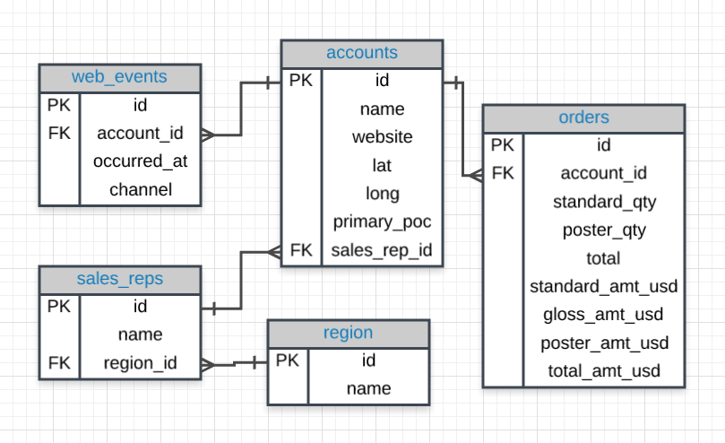
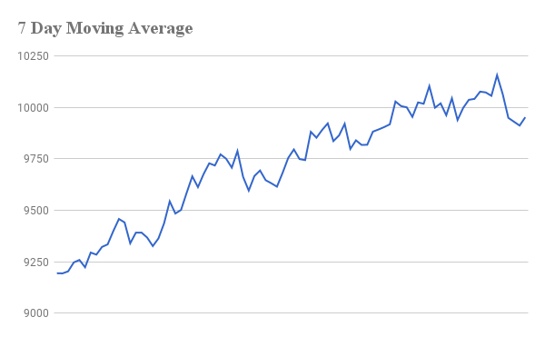

接下来这一周，我们正式进入了`SQL分析城市变暖趋势`这个项目的学习，在这个项目当中，你需要做几件事情：

1. 分析全球变暖的趋势
2. 分析你所居住地的趋势
3. 可视化对比以后，得出自己的结论

在开始之前，有几个要准备的东西：

1. 一个比较好的网速，登不上优达我的教室或者是看不了视频，尝试刷新一下，亦或者是科学上网。
2. 一个稳定的chrome浏览器，经过多次使用，chrome浏览器的稳定性较好，推荐使用。
3. 最低标配是google sheet或者是microsoft的excel，如果想要在工作当中用好excel，也可以参考一下贴出的excel快捷清单。

学习地图：

- 我们需要掌握的东西
  - sql
    - 数据库当中的实体关系图
    - 了解为什么数据分析师和企业喜欢用sql（说出3点）
    - sql的基本性质
    - 基本语句
  - 移动平均值
    - 什么是移动平均值？为什么要用移动平均值（减少每日的波动，便于看出长期的趋势）
    - 如何计算移动平均值

### 实体关系图

在实际工作中，我们经常需要查询数据库当中的好几张表，这几张表都彼此有关系，而实体关系图就是描绘表与表之间的关系图。可以理解为“延禧攻略”当中的人物关系图。上面有5个电子表格，web_events，accounts，sales_reps，region和orders，底下是它们的属性，也就是表格的列名，它们彼此之间的属性是相互有所关联的。

### sql的基本性质

1.类似于excel的表格

2.每列数据类型一致

3.列可以有多种数据类型

### 基本语句

创建和删除表格：CREATE TABLE/DROP TABLE 

查询语句：SELECT，LIMIT，WHERE，AND，BETWEEN，NOT，OR

##### 写sql之前注意两条：

1.想要看到什么信息？也就是`SELECT`语句后面所跟的列，你想要知道哪些属性？比如销售额，单价，成本之类的

2.从什么子查询当中获取？也就是FROM后面所跟的数据源，现在目前只需要是列名，但也可以是子查询。

### 什么是移动平均值

销售额会受到是否周末有大的影响

计算移动平均后，可以一定程度上平滑曲线，看出整体趋势。

# 二、项目内容

你需要完成的步骤：

1.用你掌握的sql语句来下载你对应的城市的气温数据

2.下载全球变暖的数据

3.用excel打开，绘制折线图

4.根据折线图分析趋势，得出你的结论

5.将整个过程总结成报告

可能的问题：

1.如何下载所在的城市的气温数据？注意用`WHERE`语句来限制city_list这张表的country和city字段。
2.注意global_data和当地的气温数据city_data时间上要保持一致。
3.四个观察如何入手？思路提供两个：一个是横向对比，就是分析全球和城市随着时间的变化；或者是纵向对比，分析全球和城市同一时间或者同一个时间段的大小比较或者是趋势。总之多多发挥创造力，可以多关注一些关键点，比如转折点，极值点等等。

## 一些小建议
大家可以在完成项目之前，先把要完成的内容或者说完成的步骤通过一些清单工具，比如“滴答清单“或者是”奇妙清单“列出来，完成一项，勾掉一项，有序推进项目并享受完成过程的乐趣。

# 彩蛋
##### 更多的sql练习？
这部分留给学有余力的同学以后可以继续进修，在这个项目就不要求了。
推荐[SQLBolt](https://sqlbolt.com/lesson/select_queries_with_constraints)这个交互式网站，在上面很好的一点就是教程分为许多简短的节数，由浅入深，每一节先给简单的文字的教程，然后底下有针对某个知识点的训练，哪里不会补哪里就可以了，so easy。

