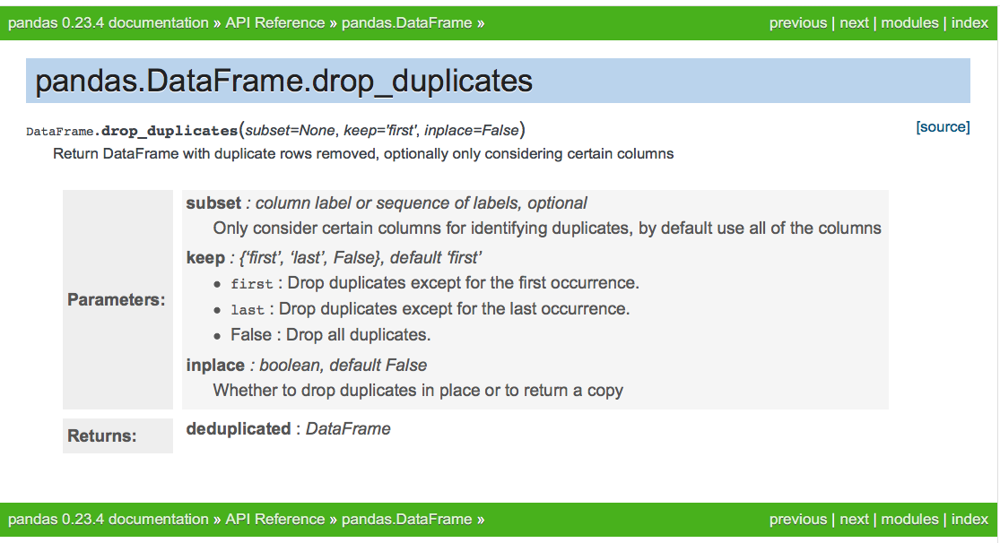
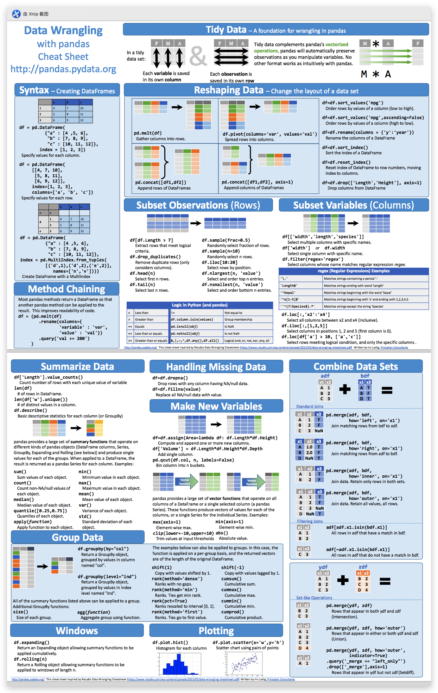
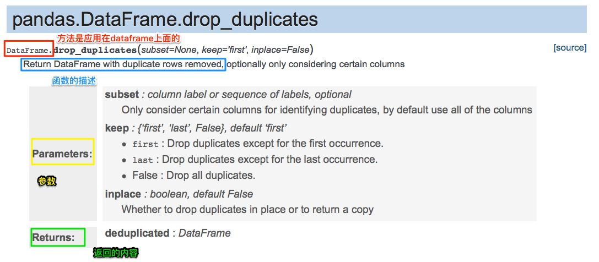
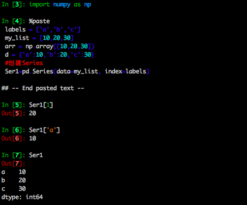
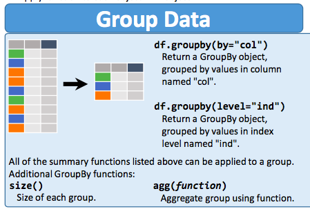
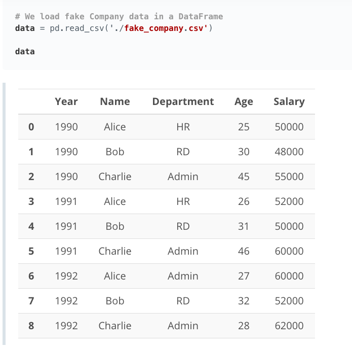
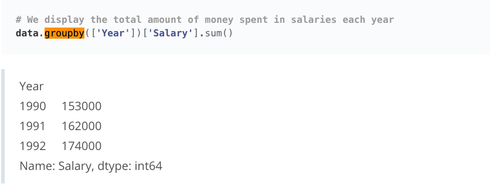

## 导航

- [本周要完成的任务](#本周要完成的任务)

- [要点提示](#要点提示)

  - 1.pandas和numpy的小抄
  - 2.如何查阅文档
  - 3.ipython的启动

- [知识点](#知识点)
  - [Pandas第一部分（一维数组部分）](#Pandas第一部分（一维数组部分）)
  - [Pandas第二部分（二维数组部分）](Pandas第二部分（二维数组部分）)
  - 几点关于Pandas的注意事项
  - 如何

- 彩蛋

  - 学习jupyter notebook的高效操作

  - numpy和pandas的更多练习

  - 集成所有参考文档的强大工具网站devdocs


## 学习地图

### ／项目总体规划／

项目名称：探索共享单车用户行为规律 

项目时间：4周 

- 第1周：Python基础内容 - Python基础（数据类型和运算符、控制流、函数、脚本编写） 
- **第2周：Python数据处理内容 - Python数据分析（学习Numpy、Pandas库基本操作）** 
- 第3周：完成项目并实现第一次提交
- 第4周：通过项目 - 修改项目，项目的反思总结，整理成可呈现面试的项目报告

## 本周要完成的任务

- 完成numpy和pandas基础命令的使用，基本具备完成项目的能力
- 学会使用ipython或者是jupyter notebook进行调试代码
- 配置好anaconda环境，准备好项目的工具库和项目文件以及数据
- 学会搜索，阅读文档来尝试解决自己遇到的问题，这也是coder很重要的学习方式

## 要点提示

在开始学习之前，要准备好：

**1.pandas和numpy的小抄**

首先它们可以帮助你在需要的时候快速查找到相关的内容，而且在初学的时候可以作为一个知识地图了解自己需要学什么东西。在学习pandas的过程中会首次接触到它的很多用法，很多用法并不会用一次就记住，因此需要有个快速回溯查阅的渠道。

建议快速回溯的方法：先思考自己想要实现什么功能->思考这个功能的英文名并在cheat_sheet中找到对应的名字->去pandas的文档查看详细解析

例如：想对列进行去重复值->重复值的英语是"duplicate"，搜索有关"duplicate"的pandas方法->找到对应的方法"drop_duplicates"->去[Pandas的官方文档](http://pandas.pydata.org/)查看具体的解析。



小抄链接:https://pan.baidu.com/s/1vIdkjAAbDV5ZFT8m78k3gw  密码:r3oi



2.如何查阅文档

学习查阅文档是coder必不可少的技能，这个部分可以简单学习当我们想学习一个工具库的方法，实现一个新的功能的时候我们该如何看文档。其实文档就是工具说明书，其要点有迹可循。我们可以想象，当我们买一个电饭煲的时候，其实也会关注几个方面：这是干什么用的，我需要往里面放什么，这个电饭煲处理完之后输出什么。而各种函数和方法就是电饭煲，我们传入的参数就是大米，产生的结果就是香飘飘的米饭。



查看文档要看几个部分，一个是方法是应用到什么类型上的，比如drop_duplicates是应用到Pandas DataFrame上的，也就是红色框框部分；函数的描述，实现什么功能的，就是蓝色框部分；以及要传入什么参数，每个参数又是什么意思，黄色框部分；返回什么值，绿色方框部分。

3.ipython的启动

`ipython`由于其交互式的友好体验，十分适合用来前期做一些代码的测试和工具库使用的学习。

启动方法：在终端或者命令行下输入`ipython`即可顺利启动。对于接下来的练习代码，可以复制以后，在ipython输入`%paste`即可粘贴。



## 知识点

在这里已经把知识点的重要性按照🌟的数目标示出来，🌟的数目越多，说明该章节知识点越重要，需要多花时间掌握。

我们需要掌握的内容包括：

- Numpy
- Pandas的入门介绍
- Series
- DataFrames
- Missing Data
- GroupBy

### Numpy

**NumPy** 是 *Numerical Python* 的简称，它是 Python 中的科学计算基本软件包。NumPy 为 Python 提供了大量数学库，使我们能够高效地进行数字计算。

2.Numpy简介

了解Numpy是python的一个非常高效的科学计算库。

下载anaconda，查看Numpy的版本。

3.为何要使用Numpy

- 节约内存
- 多维数组结构数据可以用来完成如机器学习和数据分析的任务
- 大量的内置数学函数

4.创建和保存Numpy ndarray

> ndarray就是n维数组的意思。
>
> 导入numpy的方式：`import numpy as np`
>
> 创建Numpy的两种方法：
>
> 1.传入Python内置列表
>
> ```python
> arr=np.array([1, 2, 3, 4])
> ```
>
> 保存和加载`numpy array`
>
> 保存和加载`numpy array`使用`save`和`load`方法
>
> 请在ipython中练习
>
> ~~~python
> #保存数组
> np.save('my_arr', arr)
> #加载已经保存的数组
> ```上述代码将 x ndarray 保存到叫做 my_arr.npy 的文件中。你可以使用 load() 函数将保存的 ndarray 加载到变量中。```
> arr_load=np.load('my_arr.npy')
> ~~~


5.使用内置函数创建ndarray

> numpy有许多内置的函数可以用来生成特定的ndarray，这部分函数需要传入一个重要参数`shape`，也就是生成的数组的形状，你可以理解为你要生成多少行(n)，多少列(m)的一个数组？`shape`用`(n, m)`表示
>
> 这部分方法有：
>
> - `np.zeros()`生成都是0的数组
> - `np.ones()`生成都是1的数组
> - `np.full()`填充数组
> - `np.eye(N)`创建单位矩阵
> - `np.diag()`创建对角矩阵
> - `np.arange()`和`np.linspace()`创建连续数字的数组，`reshape(shape)`对创建的数组进行改变形状
> - `np.random.randint(start, stop, size = shape)`生成随机的整数数组
> - `np.random.normal(mean, standard deviation, size=shape)` 会创建一个高斯分布的 ndarray

6.练习：创建ndarray

在这小节当中将上述学到的知识点练习一下，看一下返回的结果。

7.访问和删除ndarray中的元素及向其中插入元素🌟🌟🌟

> 在这小节当中，掌握以下几个部分：
>
> **索引**
>
> 对一维的numpy ndarray索引可以用`arr[n]`的方式，对二维的numpy array索引可以用`arr[n][m]`的方式，三维及以上以此类推。
>
> **追加**
>
> `np.append(ndarray, elements, axis)` 函数向 ndarray 中附加值
>
> 请在ipython中练习 
>
> ```python
> # We create a rank 1 ndarray 
> x = np.array([1, 2, 3, 4, 5])
> # We append the integer 7 and 8 to x
> x = np.append(x, [7,8])
> ```
>
> `np.insert(ndarray, index, elements, axis)` 函数向 ndarray 中插入值，类似于`append`，只不过`append`是在尾部追加，而`insert`在我们指定完`index`的位置以后可以在中间插入。
>
> `np.vstack()`和`np.hstack()`对numpy array进行垂直方向和水平方向的堆叠

8.ndarray切片

>  三种类型的切片
>
> ```python
> ndarray[start:end]
> ndarray[start:]
> ndarray[:end]
> ```

9.布尔型索引、集合运算和排序🌟🌟

>  上一节我们了解了怎么样去索引特定位置的numpy ndarray。但有时候我们想根据条件去筛选特定的数据，比如大于10并且小于20的数据。这个时候我们就需要加入逻辑判断，逻辑判断的条件返回的是True或者是False，是对数值的判断是否满足筛选条件。
>
> 请在ipython中练习
>
> ```python
> a=15
> print((a>10)&(a<20))
> ```
>
> 返回的结果是什么？以上就是一个对a的逻辑判断，`&`是连接两个条件的符号。其逻辑判断与python基础当中的逻辑判断条件是一样的，我们可以把它加入到对numpy ndarray的索引当中。
>
> 请在ipython中练习
>
> ```python
> # We create a 5 x 5 ndarray that contains integers from 0 to 24
> X = np.arange(25).reshape(5, 5)
> # We use Boolean indexing to assign the elements that are between 10 and 17 the value of -1
> X[(X > 10) & (X < 17)] = -1
> ```

10.练习：操纵ndarray

> 该部分对前面的条件筛选进行训练。

11.算术运算和广播

> 广播是什么意思？
>
> 初学numpy array的同学可能不太明白`广播`这个词是如何理解。
>
> 其实我们可以想象一个场景，在学校学生做广播体操的时候，学生是不是拍成一个大的方方正正的矩阵？随着广播的命令，每一排的学生或者是每一列的学生依次进行广播的命令进行相同的操作。numpy array的每个元素就类似于广播体操里面的学生，而我们将一个函数比如`np.add(X, Y)`应用到`X`和`Y`上，就相当于下达一个命令，`X`和`Y`里面的元素就会乖乖按照指令，站到对应的位置进行相加。当然，我们很多时候都会指定`axis=0`还是`axis=1`，来说明是对行进行操作还是对列进行操作。
>
> 请在ipython中练习
>
> ```python
> # We create two rank 2 ndarrays
> X = np.array([1,2,3,4]).reshape(2,2)
> Y = np.array([5.5,6.5,7.5,8.5]).reshape(2,2)
> 
> # We print X
> print()
> print('X = \n', X)
> 
> # We print Y
> print()
> print('Y = \n', Y)
> print()
> 
> # We perform basic element-wise operations using arithmetic symbols and functions
> print('X + Y = \n', X + Y)
> print()
> #尝试一下传入axis=0和axis=1的差别是什么
> print('add(X,Y) = \n', np.add(X,Y))
> print()
> print('X - Y = \n', X - Y)
> print()
> print('subtract(X,Y) = \n', np.subtract(X,Y))
> print()
> print('X * Y = \n', X * Y)
> print()
> print('multiply(X,Y) = \n', np.multiply(X,Y))
> print()
> print('X / Y = \n', X / Y)
> print()
> print('divide(X,Y) = \n', np.divide(X,Y))
> ```
>
> 对`单个元素进行运算`这部分对照该节知识点进行训练。

12.练习：通过广播创建ndarray

> 这个练习将上面的广播进行训练，注意axis参数。

13.为迷你项目做准备

> 推荐安装anaconda，参考"(选修)安装anaconda"部分。

14.迷你项目：均值标准化和数据分离

> 为什么要进行均值标准化？
>
> 所有数据采用相似范围的值，才能够使得机器学习算法正常工作，你可以想象，如果我们想用同一个模型来分析巨人和正常人类的身高，如果我们不标准化的话，巨人与巨人的差别是不是在人类看来是很大的？但是标准化以后，有点类似于将巨人按照它们的比例缩小了，这样就可以跟人类身高的分布进行一个类比，看是不是巨人社会的身高分布与人类是一样的，同时缩放后的巨人身高也不会对模型造成很大的影响。

### Pandas第一部分（一维数组部分）

Series类似于一维数组，所不同的是Series具有索引和列名等属性。

1. pandas是python进行数据分析常用的工具包，具有两种数据结构：**DataFrame**和**Series**，这两种数据结构带有标签和索引，我们可以使用pandas十分方便地去操控数据，你可以认为pandas是非常强大的excel。
2. pandas入门介绍🌟🌟

> - 为何要使用numpy和pandas？
>
> 了解`numpy`具有多个函数，在批量计算方面优于内置的`python`。
>
> 了解Pandas Series 和 DataFrame 专门用于快速进行数据分析和操纵，并且使用起来灵活简单
>
> - 如何导入一个库并重命名？
>
>   在ipython练习`import pandas as pd`，如何导入numpy呢？

3. 创建Pandas Series🌟🌟

>   Pandas Series 和 NumPy ndarrays的两个区别
>
>   1. Pandas Series这一列是可以给它一个名字的，而NumPy ndarrays是没有标签名字的。pandas的`index`方便进行行索引。
>   2. Pandas Series可以存储除了包括数字的其他格式的数值，比如文本；而NumPy ndarrays只能存储数值型数据。
>
>   练习几个操作
>
>   1. 用`pd.Series`创建Series
>
>    ```python
>    #series可以从列表或者是numpy array生成
>    labels = ['a','b','c']
>    my_list = [10,20,30]
>    arr = np.array([10,20,30])
>    d = {'a':10,'b':20,'c':30}
>    #创建Series
>    Ser1=pd.Series(data=my_list, index=labels)
>    ```
>
>   以上我传入了`my_list`作为数据，`labels`作为索引。你能尝试传入`arr`看看结果吗？直接传入字典d呢？
>
>   2. 用`index`去索引
>
>   ```python
>   #尝试一下取一下特定索引数值
>   print(Ser1)
>   print(Ser1['a'])
>   print(Ser1[0])
>   ```
>
>   在上面`a`是labels列表的元素，在这里打印出来的是什么？是不是可以理解为拿着钥匙a去找data里面对应的数值？
>
>   3. Series的属性
>
>   Pandas Series具有一系列的属性
>
>   ```python
>   print(Ser1.size)#元素的个数
>   print(Ser1.ndim)#Series的维度数目，Series都是一维的
>   print(Ser1.shape)#Series的形状，类似于ndim
>   print(Ser1.index)#Series的索引标签
>   print(Ser1.values)#Series的值，类型是numpy array，所以才说pandas是在numpy基础上建立起来的
>   ```
>
>

4. 访问和删除Pandas Series中的元素🌟🌟🌟

> 1. 访问元素
>
> Pandas Series既可以用`[]`数字索引，也可以用index标签索引；Numpy array用数字索引。
>
> 除了这种`[]`的索引方式，也可以用`loc`和`iloc`的方法。两者的区别是`loc`传入的是标签，为标签索引；`iloc`传入的是位置数字，为数字索引。（记忆的方式是`iloc`的`i`代表的是index，因此要传入的参数是数字）
>
> 请在ipython中练习
>
> ```python
>  Ser1=pd.Series(data=my_list, index=labels)
> print (Ser1.iloc[[0,2]])#传入的是数字
> print (Ser1.loc[['a','c']])#传入的是label index
> ```
>
> 2. 删除元素
>
> `DataFrame.drop(label, inplace=True)`可以原位删除掉标签名字为label的那一行。
>
> 请在ipython中练习
>
> ```python
> Ser1.drop('a', inplace=True)
> Ser1#对比前后的结果
> ```

5. 对Pandas Series执行算术运算

> 1. 运用`numpy`的函数对Pandas Series进行运算
> 2. 运用算术运算符对Pandas Series进行运算
> 3. 对Pandas Series进行个别元素的计算

6. 练习：操纵Series

> 练习sun_planets.py的操作，基本串上了之前的知识点，如果觉得比较轻松，说明掌握了。

## Pandas第二部分（二维数组部分）

Pandas DataFrames 是具有带标签的行和列的二维数据结构，可以存储很多类型的数据。如果你熟悉 Excel 的话，可以将 Pandas DataFrames 看做类似于电子表格。

7. 创建Pandas DataFrame

> 两步走，先创建好一个Pandas Series/列表的字典或者是字典的列表，将这个字典传入到`pd.DataFrame()`当中。
>
> 在这一节当中，请对应列出的知识点在ipython中练习几种创建dataframe的方法
>
> 1. 传入列表的字典
>
> ```python
> # We create a dictionary of lists (arrays)
> data = {'Integers' : [1,2,3],
>         'Floats' : [4.5, 8.2, 9.6]}
> # We create a DataFrame 
> df = pd.DataFrame(data)
> # We display the DataFrame
> df
> ```
>
> 2. 传入字典的列表
>
> ```python
> # We create a list of Python dictionaries
> items2 = [{'bikes': 20, 'pants': 30, 'watches': 35}, 
>           {'watches': 10, 'glasses': 50, 'bikes': 15, 'pants':5}]
> # We create a DataFrame  and provide the row index
> store_items = pd.DataFrame(items2, index = ['store 1', 'store 2'])
> # We display the DataFrame
> store_items
> ```
>
> 在打印完之后，观察一下Pandas DataFrame是不是有列名也有行索引？它们分别来自字典和列表的哪个部分？提示：字典的键往往就是用来索引的，所以传入Pandas DataFrame的字典的键是作为列名存在的。
>
> Pandas DataFrame也是具备和Series一样的属性，不妨试试看`store_items.shape`。

8. 访问Pandas DataFrame当中的元素🌟🌟🌟

这部分要重点关注喔，有很多关于Pandas DataFrame的知识点都是在这里学习的。

我们回顾一下，之前Pandas Series索引的方式是`Ser1[row_number]`，`Ser1.iloc[row_numbr]`以及`Ser1.loc[index_name]`三种。类似地，Pandas DataFrame也是三种索引方式，我们可以想象得到，因为Pandas DataFrame比Pandas Series多了列这个维度，所以只要对列也进行索引即可。所以相对应也有3种索引方式。

> 请在ipython中练习
>
> ```python
> # We create a list of Python dictionaries
> items2 = [{'bikes': 20, 'pants': 30, 'watches': 35}, 
>           {'watches': 10, 'glasses': 50, 'bikes': 15, 'pants':5}]
> # We create a DataFrame  and provide the row index
> store_items = pd.DataFrame(items2, index = ['store 1', 'store 2'])
> # We display the DataFrame
> store_items
> #按照方框[]进行索引
> store_items['bikes'][1]#dataframe[column][row]
> #按照loc进行索引
> store_items.loc['bikes', 'store2']
> #按照iloc进行索引
> store_items.loc[0, 1]
> ```
>
>

其他要学习的语法包括：

1.删除所用的`pop`和`drop`。

2.`rename`对列名进行重新命名。

3.set_index将某一列

9. 处理NaN值🌟🌟🌟

处理缺失值是数据分析当中的很重要的任务，数据的前期处理甚至占了数据分析的工作量的很大一部分。

> 1. NaN值的介绍
>
> Pandas会对缺失的部分进行分配`NaN`值，`NaN`就是not a number的意思，`NaN`会对统计结果造成一定影响，因此需要进行处理。
>
> 2. 对`NaN`值进行统计
>
> `isnull()`和`notnull()`可以对`null`值和`非null`值进行判断，返回布尔值`True`或者`False`。
>
> 请在ipython中练习
>
> ```python
> #对以上生成的store_items的表格进行操作
> print(store_items.isnull())#返回布尔值True或者False
> print(store_items.notnull())#返回布尔值True或者False
> #返回的布尔值True或者False与1或者0是等价的，可以用sum()进行加和，统计出数目
> print(store_items.isnull().sum())
> print(store_items.notnull().sum())
> ```
>
> 3. 对NaN值的处理
>
> 对NaN值的处理十分重要，通常有`填充空值`、`删除空值`等操作。
>
> **填充空值fillna**
>
> 填充空值使用DataFrame.fillna(method, axis, inplace)，method有三种选择，'ffill'是向前填充，'backfill'是向后填充，或者是method不传入；axis代表是填充行还是填充列，与之前遇到的axis参数是一样的；inplace同理是否原位修改。
>
> **删除空值dropna**
>
> `dropna(axis, inplace)`，`dropna`只需要传入两个参数，axis与inplace参数与前面是一样的。
>
> 请在ipython中练习
>
> ```python
> #填充空值使用DataFrame.fillna(method, axis, inplace)
> print (store_items.fillna(method='ffill', axis=1))
> print (store_items.fillna(method='backfill', axis=1))
> print (store_items.fillna(1, axis=1))
> ```
>

10. 练习：操纵DataFrame

这个练习把之前的知识点串了一遍，需要好好做一下。

11. 将数据加载到Pandas DataFrame🌟🌟🌟

> **读取文件**
>
> `pd.read_csv`可以用来读取csv文件，很多时候我们并不是自己从无到有创建一个dataframe，而是可以直接从已有的csv，txt，excel等文件直接读取，并且生成Pandas DataFrame。
>
> 请在ipython中练习
>
> ```python
> # 我们将 Google 股票数据加载到 DataFrame 中
> Google_stock = pd.read_csv('./GOOG.csv')
> Google_stock
> ```
>
> **查看加载后的DataFrame的信息**
>
> 在加载完数据以后，我们通常需要查看一下关于这个数据集的一些信息，比如缺失值的情况，整体的分布，字段有哪些等等，有一系列方法可以达到目的。
>
> - `df.head()`可以查看前面的几行，你可以传入一个数字代表选择多少行，类似的`df.tail()`查看尾部的几行。
> - `df.info()`查看总体信息，主要是数值类型以及缺失值情况
> - `df.describe()`可以查看总体的统计学变量，包括平均值，最大值，四分位数以及中位数等等，数据的总体分布一目了然有木有？
> - 数学函数`mean()`, `sum()`, `median()`, `max()`跟在df后面，你可以通过英文单词认得出是什么用途吗？
>
> **groupby的用法**
>
> `groupby()`是对数据进行分组的方法。
>
> 我们查看下groupby整个过程发生了什么
>
> 
>
> 可以看到原本的数据集，通过`groupby('col1')`用法以后，col当中相同的值就会被分到同一组当中，然后通过应用某个聚合函数例如`sum(),` `mean()`, `max()`等函数返回一个对分组数据的一个操作结果。
>
> 
>
> 
>
> 在练习当中，读取的数据`data.groupby(['Year'])['Salary'].sum()`，通过对`Year`这个字段进行分组，然后对`Salary`这个字段进行加和`sum()`统计，最终得出每一年的`Salary`的总和。

## 几点关于Pandas的注意事项

1.很多方法的修改并不是在dataframe的基础上进行修改的，比如删除用的`drop`，`rename`这类进行对dataframe的修改，如果需要修改原本的dataframe，需要加入`inplace=True`的参数，例如`df.drop('city', axis=1, inplace=True)`；或者也可以重新定义一个dataframe，比如`df2=df.drop('city', axis=1, inplace=True)`。

2.如果是多个标签或者是多个列名的传入，需要写成一个列表的形式。比如`df[['a', 'b']]`而不是`df['a', 'b']`。

3.行和列的顺序体现。在Pandas中，行的顺序是要优于列的顺序的。体现在axis0和1分别是代表行方向和列方向，例如`drop(axis=1)`代表删除行，而传入`axis=1`代表删除列，在Pandas DataFrame的许多方法里面都有axis这个参数，代表对行方向还是列方向进行操作。

4.关于连续多个`.`连接多个方法的管道式用法。在pandas使用当中，我们经常可以看到`store_items.isnull().sum()`这种写法，如果我们仔细拆分一下的话，可以发现，store_items是一个dataframe，后面的`is_null()`是pandas一个判断dataframe每个值是否为空值的方法，然后`sum()`又是一个pandas的方法，这几个东西通过`.`连接起来。其实个中玄机很简单，我们可以想象是一条流水线加工，`store_items`这个dataframe经过`isnull()`这个方法或者说是工人的加工后输出了一个新产品，然后经过`sum()`这个方法加工后就输出了另外的一个新产品。是一种管道式的操作，每次的输出都是一个新的对象，后面的方法对这个新的对象进行操作，所以称为“面向对象编程”。

不妨尝试一下依次打印`store_items`，`store_items.isnull()`，`store_items.isnull().sum()`看依次发生了什么变化。

## 彩蛋

恭喜你完成了以上部分，这部分留给学有余力的同学继续深造的解锁技能，可自选。

### 1. 学习jupyter notebook的高效操作

想成为一个酷炫的程序员吗？

如果你的敲代码实现功能的速度是别人的好几倍，你的思路也会文思泉涌，信不信？不信尽管来过招。

学会jupyter notebook的快捷操作至少可以让你领先其他人好多等级。

参考以下链接：

[Jupyter Notebook 快速入门（上）](http://codingpy.com/article/getting-started-with-jupyter-notebook-part-1/)

[Jupyter Notebook 快速入门（下）](http://codingpy.com/article/getting-started-with-jupyter-notebook-part-2/)

### 2. numpy和pandas的更多练习

这部分配套练习资料已经共享，地址为 链接:https://pan.baidu.com/s/1k3KDN3Fvevnr-cLDE4UlyA  密码:pkm7

作为参考，这部分上面有教程和配套知识点的练习。

### 3.集成所有参考文档的强大工具网站[devdocs](http://devdocs.io/)

只能点开看看咯。