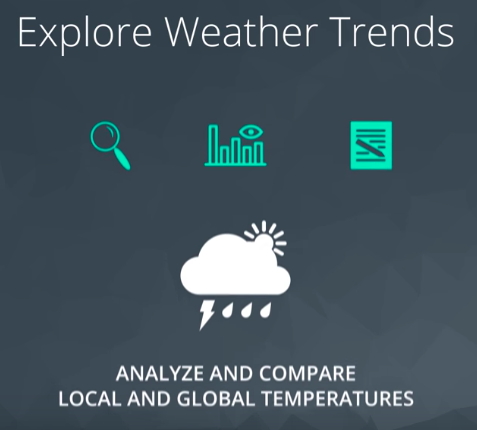
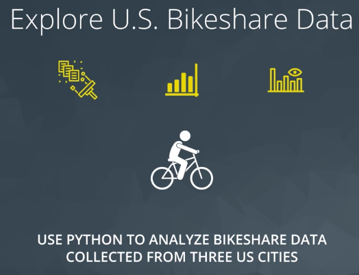
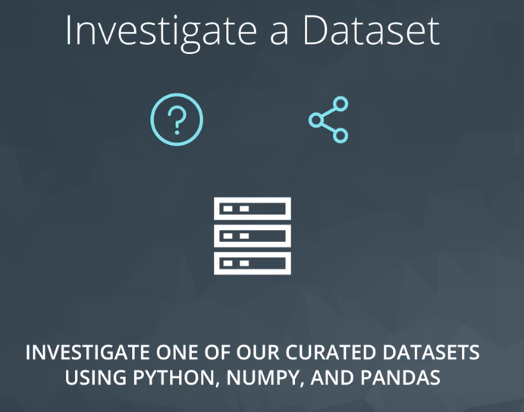
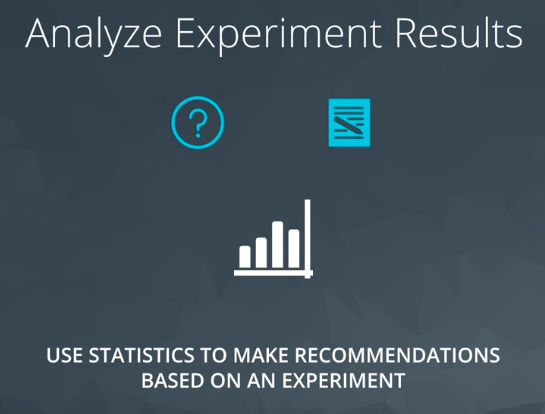
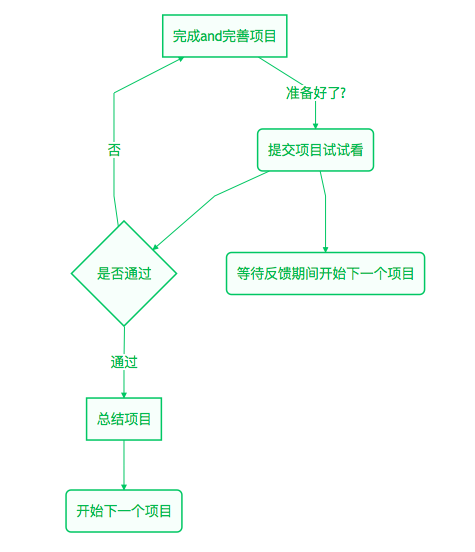

### 学习地图：

- 明确自己学习的动机
  - 数据分析非常有前景，可以看一下[数据分析师薪资有多高？](https://www.sohu.com/a/161403949_401265)
  - 数据分析入门是一个非常好的起点，可以通向机器学习、深度学习、大数据分析等各个细分领域
  - 转行？兴趣？
  - ……
- 找到自己的学习节奏
  - 自己是突击型？不妨以项目为导向，去先试试身手，再看自己哪里不会补哪里
  - 自己是稳步有序型？可以了解完项目，再制定自己的学习schedule，按照每个节点去完成相应的任务

### 项目安排

本课程是按照项目为导向的，一共有4个项目，分别是用SQL探索气候变暖的趋势、分析美国三座城市的共享单车数据、使用Python，Numpy和pandas探索数据集、基于实验使用统计学去分析数据得出结论。重点在于完成项目而并不是完成知识点的按部就班，学员可以根据自己的实际情况来选择自己的学习节奏。

项目的三个流程步骤：

1. 集中学习知识点，你可以通过视频，或者是文字教程等方式。
2. 开始完成项目。在这个阶段根据自己的情况，可以一点一点地完成项目，然后提交之后等待反馈结果。编程是一个不断迭代的过程，哪怕一开始做得不够完善，只要完成了就可以提交，以此检验一下自己有待完善的地方。提交之后在等待的过程中可以进入下一个项目的学习。
3. 完善项目并到最后的通过。这个阶段在提交完项目之后会轻松很多，只是需要对reviewer反馈的结果进行点对点的修改，在这个阶段建议用滴答清单的方式列出要修改的点，一个一个去修改完成，特别有成就感。

##### 分析气候变暖的趋势

分析美国共享单车

探索数据集

分析实验数据

#### 为什么要做项目

- 做项目能够帮助你在实践当中学习。
- 项目可以帮你积累宝贵的学习经验，这些作品集可以展示给你的雇主，在将来面试的时候十分有优势。

通过流程

推荐大家能够运用的几款工具：

滴答清单

> 滴答清单不仅是一款能够帮助你梳理思路，还是一个很好的工作理念GTD的实现方式。你可以将一个棘手的问题分解到每个可以执行的步骤，对于我们做项目或者是思考一个问题的时候是不错的分解工具，不妨用它来规划自己的学习和工作。
>
> 

Forest

> 学习的时候如果觉得不能集中注意力，可以考虑用这款集中注意力的app，在一棵树的时间里面帮助你集中注意力到手头上面的事情。
>
> 
